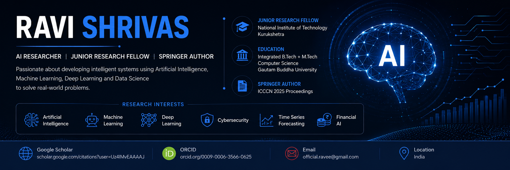

  

 
<h1 align="center">Hi 👋, I'm Ravi Shrivas</h1>

Integrated B.Tech + M.Tech in Computer Science,🎓 from <a href="https://www.gbu.ac.in/">Gautam Buddha University 🏛</a>

🎓 Junior Research Fellow @ National Institute of Technology Kurukshetra

🔬 Research Interests

- Artificial Intelligence
- Machine Learning
- Deep Learning
- Cybersecurity
- Time Series Forecasting
- Financial AI

📄 Publication

**Real-Time Cryptocurrency Forecasting Using Mamba-SSM**

Published in Springer Nature
Proceedings of the Fifth International Conference on Computing and Communication Networks (ICCCN 2025)

🌱 Currently Learning

- Large Language Models
- AI Agents
- Advanced Persistent Threat
- Reinforcement Learning

## 🛠 Tech Stack

## 🌐 Academic Profiles

## 📈 GitHub Stats

📫 Connect

---

### ⭐ "Research is creating new knowledge." — Neil Armstrong ⭐

